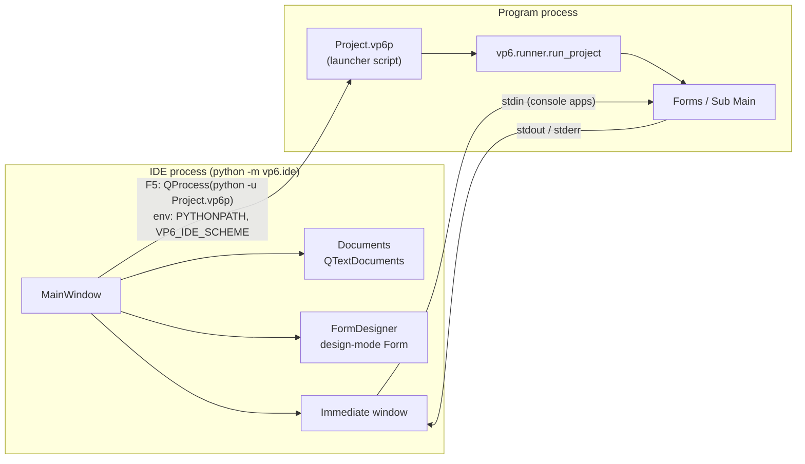
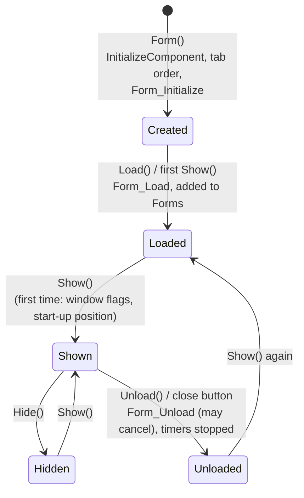
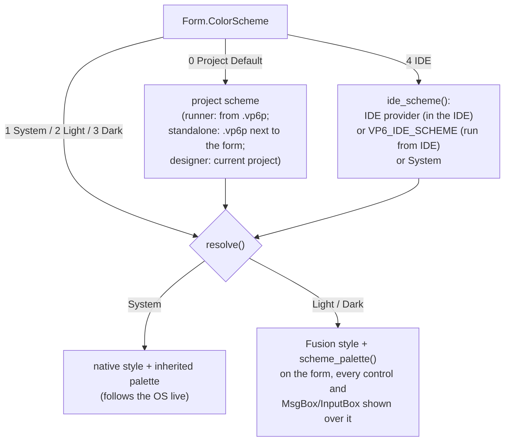
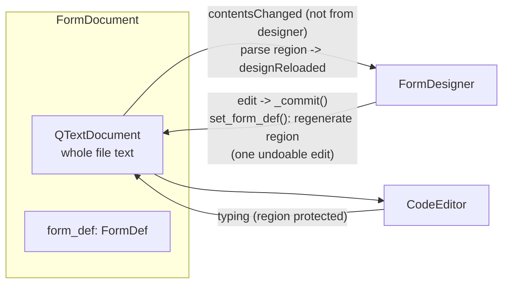

# VP6 architecture

This document describes how VP6 is put together: the two halves of the
system, the processes involved, the data flows between components, the file
formats, and the cross-cutting systems (properties, events, color schemes,
settings). For a file-by-file breakdown see
[source-reference.md](source-reference.md). For the programming API see
[api.md](api.md).

## 1. Goals and guiding decisions

VP6 recreates the Visual Basic 6 experience for Python: draw a form, set
properties, double-click a control to write its event handler, press F5.
Several decisions shape the whole code base:

| Decision | Consequence |
|---|---|
| **The runtime is an ordinary Python library** (`vp6`), usable without the IDE. | Programs are plain Python files; the IDE is just one way to edit them. `python Form1.py` works. |
| **The designer shows real runtime objects.** The form in the designer is an actual `Form` instance in *design mode* with actual controls on it. | What you see is exactly what runs; there is no second rendering of controls to keep in sync. |
| **One source of truth per file: its text.** Each open file is a `QTextDocument`; the designer edits a generated region inside that text. | The code window and designer can never disagree; undo in the code window can even undo designer changes. |
| **User code is never executed by the IDE.** Form and project files are read with `ast` and `ast.literal_eval`. | Opening a project is safe; a syntax error elsewhere in a file doesn't break the designer. |
| **Metadata drives everything.** Each control declares its properties (`PropSpec`) and events once. | The property grid, the designer serializer, default elision and the API tables all come from the same declarations. |
| **Programs run in a separate process.** | A crashing or hanging program can't take the IDE down; the IDE stays responsive and can kill it. |
| **VB naming for the public API.** `Caption`, `Show()`, `MsgBox`, `Command1_Click`, constants with a `vp` prefix (`vpYes`, `vpRed`). | Familiar to VB programmers; private implementation uses normal Python naming with a leading underscore. |

## 2. Package layout

```
vp6/                    runtime library - "from vp6 import *"
  __init__.py           public API re-exports (__all__)
  _props.py             PropSpec / PropertyHost: declarative properties
  app.py                QApplication, App/Screen/Clipboard/Debug, DoEvents, End, error trap
  appearance.py         light/dark color schemes for forms
  colors.py             VB-style BGR colors, RGB(), QBColor()
  constants.py          vp* constants (MsgBox, keys, ...)
  controls.py           Control base class + 12 intrinsic controls
  dialogs.py            MsgBox, InputBox
  form.py               Form, Forms, Load, Unload, run
  formfile.py           parse/generate the designer region of form files
  project.py            .vp6p project files (executable launcher scripts)
  runner.py             run a project (form or Sub Main)
  ide/                  the IDE - "python -m vp6.ide" or the "vp6" command
    __main__.py         entry point
    mainwindow.py       MainWindow: menus, docks, MDI, running programs
    designer.py         FormDesigner: the form design surface
    chrome.py           window frames painted around the designed form
    codeeditor.py       CodeWindow / CodeEditor / PythonHighlighter
    properties.py       Properties window (property grid)
    projectprops.py     the project as a Properties window target
    panels.py           Toolbox, Project Explorer, Immediate and Output windows
    outputcapture.py    captures the IDE's own stdout/stderr for the Output window
    outline.py          the Outline window: structure of the current file
    documents.py        Document / FormDocument (open files)
    dialogs.py          New Project, Project Properties, About
    kitchensink.py      the Kitchen Sink project template
    templates/kitchensink/   its sources: Form1.py, frmDialog.py, Module1.py
    options.py          Tools > Options dialog
    theme.py            editor themes, IDE light/dark, settings store
    icons.py            icons drawn in code (light + dark variants)
tests/                  pytest suite (runs headless)
tools/apidocs.py        generates the reference tables in docs/api.md
samples/                Calculator (GUI) and GuessNumber (console)
docs/                   this documentation
```

The runtime (`vp6/*.py`) never imports the IDE (`vp6/ide`). The IDE imports
the runtime freely: the designer instantiates runtime forms and controls, the
property grid reads their metadata, and so on. A few runtime hooks exist only
so the IDE can plug in, for example `appearance.ide_scheme_provider` and
`Form._control_widget_changed`.

## 3. Processes



* **The IDE process** runs `vp6.ide.mainwindow.main()`. It holds all open
  documents and windows, and never imports or executes project code.
* **The program process** is started by F5 (`MainWindow.run_project`) as
  `sys.executable -u Project.vp6p`. The project file is itself a launcher
  script (see §6.2) that calls `vp6.runner.run_project(__file__)`. The IDE
  passes:
  * `PYTHONPATH` prefixed with the directory containing the `vp6` package,
    so the program imports the same VP6 the IDE uses,
  * `PYTHONUNBUFFERED=1` and `PYTHONIOENCODING=utf-8`, so output streams live,
  * `VP6_IDE_SCHEME=system|light|dark`, the IDE's appearance at launch, used
    by forms whose color scheme is "IDE".
* stdout and stderr are piped into the Immediate window (stderr in the error
  color). For console projects, the Immediate window's input line writes to
  the program's stdin.
* Outside the IDE, the same script runs directly: `./Project.vp6p`.

## 4. The runtime

### 4.1 Declarative properties (`_props.py`)

Forms and controls derive from `PropertyHost`. Each class lists its
designable properties:

```python
Properties = (
    P("Caption", "str", "", always=True),
    *_geometry(97, 25),                       # Left, Top, Width, Height
    P("Alignment", "enum", 0, enum_choices("Left Justify", "Right Justify", "Center")),
    ...
)
```

`PropertyHost.__init_subclass__` generates a Python `property` for every
`PropSpec` that the class doesn't define explicitly. The generated property:

1. **get:** returns `self._read_<Name>()` if the class defines it (a live
   value from the widget, e.g. `TextBox.Text`), otherwise the stored
   `self._values[Name]`, falling back to the spec default;
2. **set:** normalizes the value by `kind` (`_props.normalize`), stores it in
   `self._values` and calls `self._apply_<Name>(value)` so the class can
   update its Qt widget.

`_init_values(props)` applies every spec in declaration order, using the given
value or the default. **Order matters.** For example `TextBox.MultiLine`
comes before `Text`, `ComboBox.Style` before `Text`, and `List` before
`Sorted`.

The same metadata feeds the IDE:

* the **property grid** builds its editor per `kind` and lists enum choices,
* the **designer region generator** writes only values that differ from the
  default (or have `always=True`),
* **completion** in the code editor lists the spec names.

Property kinds: `str`, `text` (multi-line string), `int`, `bool`, `enum`
(with `choices`), `color` (VB BGR int or `None` for the default), `list`
(list of strings), `font` (family name or `None`), `file` (path).

### 4.2 Controls and widgets (`controls.py`)

Each `Control` wraps one Qt widget (`self._widget`), created by
`_create_widget(parent_widget)`. The parent is the form or a container
control (`Frame`, `PictureBox`); `Parent._container_widget()` supplies the Qt
parent. A control registers itself with its form
(`form._register_control`), and assigning it to a form attribute
(`self.Command1 = CommandButton(self, ...)`) names it: `Form.__setattr__`
sets the control's name from the attribute name.

`Control.__setattr__` rejects unknown attribute names that start with an
upper-case letter (VB's error 438, "Object doesn't support this property or
method"). A misspelled `Captoin` therefore raises instead of silently
creating an attribute.

Widgets can be **rebuilt** (`_rebuild_widget`) when a property changes the
widget class. `TextBox.MultiLine` switches between `QLineEdit` and
`QPlainTextEdit`. All stored values and the geometry are re-applied, and the
form's optional `_control_widget_changed(control)` hook is called; the
designer uses it to re-prepare the widget.

`Timer` has no widget at run time: it uses a `QTimer`. In design mode it shows
a small stopwatch icon so it can be selected and moved.

**Colors:** non-container controls use a style sheet scoped to their Qt
class (`_qss_type`, e.g. `QPushButton { background-color: ... }`).
Containers (Frame, PictureBox) and forms use the palette instead
(`_container_palette`, `Form._apply_colors`), so their children don't
inherit a style sheet. Container palettes set only the roles that were
explicitly chosen, so everything else keeps following the form, for example
when the color scheme changes.

**Fonts:** only explicitly set attributes are resolved on the `QFont`
(family, size, bold...). The rest is inherited from the container, so
changing the form's font affects controls that don't override it.

**Stacking.** Every control visible at run time (all but `Timer`) has a
`ZIndex`:

* within a container, higher values are drawn on top, and equal values keep
  creation order;
* `Control._restack()` raises the container's children in `(ZIndex, creation
  order)` order. It runs when a control is created, when its widget is
  rebuilt, and whenever `ZIndex` changes, so run-time changes show
  immediately;
* `ZOrder(0|1)` sets `ZIndex` just above or below the siblings.

### 4.3 Event dispatch

```mermaid
sequenceDiagram
    participant Qt as Qt widget
    participant B as _EventBridge / signal
    participant C as Control
    participant F as Form (user code)
    Qt->>B: clicked / textChanged / QEvent
    B->>C: _fire("Click") or _on_qt_event(...)
    C->>F: getattr(form, "Command1_Click")
    C->>C: app.call_handler(handler, *args)
    Note over C: trims args to what the handler declares;<br/>exceptions -> report_runtime_error
```

* **Lookup by name at call time.** `Control._fire(event, *args)` looks up
  `f"{control.Name}_{event}"` on the form each time it fires. Handlers can
  therefore be added at run time (the Calculator sample does this in
  `Form_Load` to emulate a control array). Form events use `Form_<Event>`.
* **Two sources of events:**
  * Qt **signals** for semantic events (`clicked` → Click, `textChanged` →
    Change, `valueChanged` → Change, `timeout` → Timer), wired in
    `_connect_signals`;
  * an **event filter** (`_EventBridge`) on the widget (and its viewport,
    for scroll areas) for mouse, keyboard and focus events, translated in
    `Control._on_qt_event` into VB-style arguments (`Button`, `Shift`, `X`,
    `Y`, `KeyCode`, `KeyAscii`). Controls without a native click signal
    (`Label`, `Frame`, `PictureBox`) set `_synthesize_click` to get Click from
    mouse release.
* **Flexible signatures.** `app.call_handler` inspects the handler and
  passes only as many positional arguments as it declares, so
  `def X_MouseDown(self)` and `def X_MouseDown(self, Button, Shift, X, Y)`
  both work.
* **ByRef emulation through return values:**
  * `KeyPress` returning `0` swallows the key; returning another int
    replaces the character (a new key event is sent);
  * a form's `KeyDown`/`KeyUp` with `KeyPreview` returning `0` cancels the
    key;
  * `Form_Unload` returning a truthy value cancels closing.
* **Default and Cancel buttons.** `Form._handle_default_cancel` clicks the
  `Default` button on Enter and the `Cancel` button on Esc.
* **Run-time errors.** Any exception from a handler goes to
  `app.report_runtime_error`, which prints the traceback to stderr (it shows
  up in the Immediate window, where double-clicking a traceback line jumps to
  the code) and shows a VB-style "Run-time error" box with **End** /
  **Continue**. `VP6_NO_ERROR_DIALOG=1` suppresses the box (used by the tests).
* **Design mode.** In the designer, `_fire` does nothing and
  `_on_qt_event` ignores input.

### 4.4 Form lifecycle (`form.py`)



* `Form.__init__` creates the top-level `_FormWidget`, applies the property
  defaults (with `Caption` defaulting to the class name), calls
  `InitializeComponent()` if defined (the designer-generated method), sets
  the tab order from `TabIndex`, then fires `Form_Initialize`.
* `Show(vpModal)` runs a local `QEventLoop` until the form is hidden, which
  makes it modal. Window flags (`BorderStyle`, `ControlBox`, `MinButton`,
  `MaxButton`) and `StartUpPosition` are applied on the first show.
* `Width` and `Height` are the **client area** in pixels (VB6 used twips and
  included the border).
* `run(FormClass)` creates the form, shows it and runs the event loop until
  all windows close. `vp6.runner.run_project` does the same for a project's
  startup form, or calls `Main()` for `Sub Main` projects.

### 4.5 Color schemes (`appearance.py`)

Each form has a `ColorScheme`; each project has a `color_scheme`.



* **Why Fusion for forced schemes.** Native styles (macOS in particular)
  ignore widget palettes, so a forced light or dark form uses Qt's Fusion
  style with a complete palette (`scheme_palette(dark)`). Qt doesn't
  propagate styles to children, so `style_tree` applies the style to a whole
  widget tree, and `Form._style_widget` styles each control as it is built.
* **Ownership of the Fusion style.** The single shared Fusion style
  (`fusion_style()`) is parented to the `QApplication`. Otherwise PySide can
  hand its ownership to a widget and delete it along with that widget.
* **Real OS appearance while the IDE forces a scheme.** When the IDE forces
  the whole application light or dark (§5.6), Qt reports the forced scheme.
  `appearance.system_is_dark()` then asks the OS directly
  (`defaults read -g AppleInterfaceStyle` on macOS, the registry on Windows;
  cached for 2 s). This is how a *System* form in the designer can still
  show the real OS appearance.

## 5. The IDE

### 5.1 Main window composition

`MainWindow` (a `QMainWindow`) has:

* a central `QMdiArea` holding designer windows (`FormDesigner`) and code
  windows (`CodeWindow`), one of each per file at most, created on demand and
  hidden rather than deleted when closed;
* five docks: **Toolbox** (`panels.Toolbox`), **Project**
  (`panels.ProjectExplorer`), **Properties**
  (`properties.PropertiesWindow`), **Immediate** (`panels.ImmediateWindow`, the
  running program's output) and **Output** (`panels.OutputWindow`, the IDE's
  own stdout/stderr). Output is hidden by default and tabbed with Immediate;
  `outputcapture.OutputCapture` redirects file descriptors 1 and 2 through
  pipes, so library output such as Qt's warnings is included, and still
  copies everything to the terminal;
* an **Outline** dock (`outline.OutlineWindow`), hidden by default and opened
  under Properties. It shows the structure of the file the Properties panel
  is about (`MainWindow._context_path`), and clicking an item goes to its
  line;
* **dock areas:** the Toolbox in the left dock area, Project over Properties
  (and Outline) in the right one, Immediate (and Output) in the bottom one. Panels in the
  **bottom** dock area are always tabs, with one title per panel and one
  body shown: `MainWindow._tab_bottom_docks` rejoins them whenever a panel is
  moved, docked, shown or hidden, and after restoring a saved layout. The
  right area keeps its panels stacked, which is why Qt's `ForceTabbedDocks`
  (every area) isn't used;
* a **Standard** toolbar ending with the light/dark switch;
* menus: File, Edit, View, Project, Format, Run, Tools, Window, Help.

State it owns: `project` (`vp6.project.Project`), `documents` (absolute path
→ `Document`), `designer_windows` / `code_windows` (path → MDI subwindow),
`process` (the running program's `QProcess`), `current_tool` (the selected
Toolbox tool).

### 5.2 Documents: one text, two views



* `Document` wraps a `QTextDocument` (with a plain-text layout) that holds
  the file's text. Saving writes that text.
* `FormDocument` also keeps `form_def`, the parsed designer region
  (`formfile.FormDef`: form props plus an ordered list of `ControlDef`).
  * `set_form_def()` regenerates the region text and replaces it as one edit
    block, with an `_updating` flag so the change isn't re-parsed.
  * Any other text change (typing outside the region, undo/redo in the code
    window) re-parses the region. If the result differs, `designReloaded`
    fires and the designer rebuilds itself; a parse error emits `parseError`
    (shown in the status bar) and keeps the last good design.
* `open_document(path)` returns a `FormDocument` when the file has a form
  class and a designer region, otherwise a plain `Document` (a module).

### 5.3 The designer

The `FormDesigner` widget contains a `QScrollArea` with a `_Canvas`:

* the canvas paints the **workspace** background (following the IDE's
  light/dark mode) and the **window frame** around the form
  (`chrome.paint`: macOS, Windows 11, GNOME or classic VB6, reflecting the
  form's `BorderStyle`, `ControlBox`, `MinButton` and `MaxButton`);
* the design form's `_FormWidget` is re-parented onto the canvas, below the
  frame's title bar (`_layout_form`);
* the canvas is at least as large as the scroll area's viewport, so the
  workspace always fills the window. It's resized when the *viewport* is
  resized (an event filter), not on the designer's own resize. The viewport
  is laid out later, so a single jump such as maximizing would otherwise
  leave the canvas at the old size;
* an `_Overlay` widget covers the whole canvas above the form. It receives
  **all** mouse and keyboard input, so the real controls underneath never
  get clicks. It paints the selection handles, the rubber band and the
  outline of a control being drawn.

`DesignForm` is a `Form` subclass with `_design_mode = True`:

* handlers never fire;
* `Visible = False` controls still show;
* window flags aren't applied;
* the background shows the grid of dots (optional);
* `_project_scheme` and `_render_scheme` come from the designer.

Its controls get `Qt.NoFocus`, so they never take the keyboard focus.

**Model and commits.** The designer keeps `form_def` (the source of truth for
the design) and `controls` (name → live runtime control). Every operation
follows the same pattern:

```python
before = self._snapshot()          # deep copy of form_def
...mutate self.form_def and the live controls...
self._commit(before)               # push undo, regenerate region, emit designChanged
```

Undo and redo in the designer are stacks of `FormDef` snapshots, separate
from the text document's own undo. Restoring a snapshot rebuilds the live
form (`load_def`).

**Stacking and hit testing.** Controls are stacked by their `ZIndex`
property within each container. Equal values keep creation order, with later
controls on top. Bring to Front and Send to Back set `ZIndex` (through the
runtime `ZOrder` method). `control_at` asks Qt which widget is under the
point (`childAt`) and maps it back to its control, so a click always picks
what is visibly on top.

**Signals** used by the main window:

| Signal | Meaning |
|---|---|
| `selectionChanged` | refresh the Properties window |
| `designChanged` | properties or structure changed |
| `viewCodeRequested(obj, event)` | double-click or View Code |
| `toolConsumed` | a control was drawn; reset the Toolbox |
| `formRenamed(old, new)` | update the project's startup form |
| `statusMessage(str)` | show a status bar message |

### 5.4 The code window

`CodeWindow` = Object and Procedure combos + `CodeEditor`
(`QPlainTextEdit`).

* **Highlighting.** `PythonHighlighter` is attached once per document. It
  uses block state bits for triple-quoted strings and "inside the designer
  region" (the region gets its own background color).
* **Designer region.**
  * Folded by default: its blocks are hidden, and the gutter shows a
    [+]/[-] box.
  * Protected: any edit touching it is rejected with a beep and a status
    message (`_edit_allowed` covers typing, Backspace/Delete at the
    boundaries, cut, paste and drops). A new line right before or after the
    region is allowed.
* **Combos.** Choosing an event creates a stub if needed, with VB's
  parameters from `controls.EVENT_ARGS`, at the end of the form class. Moving
  the cursor updates the combos to the enclosing `def`.
* **Completion** (`complete()`):
  * `self.` lists the form's controls and members;
  * `self.Control1.` lists that control type's properties and methods;
  * otherwise it offers VP6 names, keywords, builtins and words from the file.

### 5.5 Properties window

`PropertiesWindow.refresh()` lists the **intersection** of the selected
objects' `PropSpec`s, alphabetically. A value that differs between selected
objects shows blank. A `(Name)` row is added for a single selection.

Each row gets an editor by `kind`:

| Kind | Editor |
|---|---|
| `bool`, `enum` | combo box |
| `color` | swatch button with menu: Default, Choose…, Palette |
| `list`, `text` | dialog |
| `font` | font-family combo |
| `file` | browse button |
| `int`, `str` | line edit |

The window is bound to a *target*. `MainWindow._properties_target()` picks it
and `_update_properties_target()` applies it. That happens whenever the
Project Explorer's selection changes, the Project panel is shown or hidden,
a window is activated, or you work in a designer.

**With the Project panel open**, the target follows its selection:

| Selected | Target |
|---|---|
| the project | `projectprops.ProjectTarget` (Name, Type, StartupObject, ColorScheme) |
| a form with an open designer | its `FormDesigner` |
| a form without a designer, or a module | a `projectprops.FileTarget`, which shows just `(Name)` |
| a folder, or nothing | none, so the panel is empty |

**With the Project panel closed**, the target follows the active window: a
designer, or the form or module of a code window.

All targets offer the same interface (`selected_objects`, `set_property`,
signals…), so the Properties window has no special cases.

Committing calls `target.set_property(name, value)`. For a designer, that
applies the value to every selected object, updates `form_def` and commits. `Name` is
routed to `rename()`, which also renames event handlers and `self.X`
references in the code (`formfile.rename_control_references`).

### 5.6 Themes and IDE appearance (`theme.py`)

`ThemeManager` (singleton via `theme_manager()`) holds `EditorSettings`:

* `selection`: a theme name or `System`;
* `system_light` / `system_dark`: which theme to use for each OS appearance;
* `font_family`, `font_size`;
* `frame_style`, `show_grid` (designer options);
* `themes`: built-in Light/Dark plus custom themes.

Its `changed` signal tells every consumer to re-apply: editors,
highlighters, the Immediate window, designers, icons and the main window.

When the main window calls `manage_application()`, the manager also forces
the whole application's scheme to match the selected theme:

* `System` → `styleHints().unsetColorScheme()`, follow the OS;
* a theme → `setColorScheme(Dark|Light)`. On platforms that don't honor
  that (e.g. the offscreen test platform), it falls back to
  `app.setStyle("Fusion")` + `appearance.scheme_palette`, and restores the
  native style when switching back.

`ThemeManager.ide_scheme()` is registered as
`appearance.ide_scheme_provider`, which is what forms with
`ColorScheme = 4 - IDE` resolve to inside the IDE.

### 5.7 Running and stopping

`MainWindow.run_project`:

1. saves all documents and the project;
2. starts `QProcess(sys.executable, ["-u", project.path])` with the
   environment described in §3;
3. streams output into the Immediate window (`pump_process_output`) and
   enables its input line for console projects;
4. sets the title to `Project - VP6 [run]`.

End kills the process. The finish handler flushes the remaining output and
prints "■ Program exited with code N". Restart chains a new run onto
`finished`.

## 6. File formats

### 6.1 Form files (`*.py`)

```python
from vp6 import *


class Form1(Form):
    # region VP6 Designer - generated by the form designer, do not edit
    def InitializeComponent(self):
        self.Caption = 'Hello'
        self.Width = 480
        self.Height = 360
        self.Frame1 = Frame(self, Caption='Options', Left=16, Top=16, Width=185, Height=129)
        self.Option1 = OptionButton(self.Frame1, Caption='A', Left=16, Top=24, Width=121,
                                    Height=25, TabIndex=1)
    # endregion

    def Form_Load(self):
        pass


if __name__ == "__main__":
    run(Form1)
```

Rules for the region (`formfile.parse_region_body`):

* It starts at a line matching `# region VP6 Designer` and ends at the next
  `# endregion`.
* It contains exactly one `def InitializeComponent(self):` whose body has
  only:
  * `self.<FormProperty> = <literal>`, or
  * `self.<Name> = <ControlType>(self | self.<Container>, <Prop>=<literal>, ...)`.
* A container must be defined before its children. Statement order is
  creation order, which decides stacking among controls with equal `ZIndex`.
* Values are literals only, read with `ast.literal_eval`. Colors are written
  as hex, like `0x00FF00` (VB BGR order).
* The generator (`generate_region`) writes form properties, then controls in
  order. Values equal to the default are left out unless the spec has
  `always=True`. Lines wrap at 99 characters, aligned after the `(`.

### 6.2 Project files (`*.vp6p`)

An executable Python script (mode `+x` for everyone who can read it):

```python
#!/bin/sh
"exec" "${VP6_PYTHON:-python3}" "$0" "$@"
# VP6 project - run this file to start the program:  ./Calculator.vp6p
# ...

# region VP6 Project - maintained by the VP6 IDE, do not edit
PROJECT = {
    "name": "Calculator",
    "type": "exe",                      # "exe" (GUI) or "console"
    "startup": "frmCalculator",         # a form class name, or "Sub Main"
    "forms": ["frmCalculator.py"],
    "modules": [],
    "color_scheme": "system",           # "system", "light", "dark" or "ide"; forms inherit it
}
# endregion

if __name__ == "__main__":
    import sys
    try:
        from vp6.runner import run_project
    except ImportError:
        sys.exit("VP6 is not installed for ... Set VP6_PYTHON ...")
    sys.exit(run_project(__file__))
```

* **The first two lines are a shell/Python polyglot.** `/bin/sh` executes
  line 2, which re-executes the file with `$VP6_PYTHON` (default: `python3`
  on `PATH`). To Python, line 2 is a string expression that does nothing.
* **Reading.** `Project.load` reads `PROJECT` with `ast` (`project.parse`).
* **Saving.** `Project.save` rewrites only the region when the file exists,
  so user code elsewhere is kept, then calls `make_executable`.

## 7. Settings and environment

The IDE stores its settings with `QSettings` through `theme.ide_settings()`,
under organization `VP6` and application `VP6 IDE`. That's a plist on macOS,
the registry on Windows and an INI file on Linux. Always use
`ide_settings()`: it respects `QSettings.defaultFormat()`, which the test
suite redirects to a temporary INI file.

| Key | Written by | Meaning |
|---|---|---|
| `geometry`, `state` | `MainWindow.closeEvent` | window and dock layout (removed by View > Reset Window Layout) |
| `recent` | `MainWindow._remember` | recent project paths (max 10) |
| `tabbed` | Window > Tabbed Documents | MDI view mode |
| `editor/theme` | ThemeManager | selected theme or `System` |
| `editor/system_light`, `editor/system_dark` | ThemeManager | themes used for each OS appearance |
| `editor/font_family`, `editor/font_size` | ThemeManager | code font (empty/0 = default) |
| `editor/themes` | ThemeManager | JSON of themes that differ from the built-ins |
| `designer/frame_style` | ThemeManager | `auto`, `macos`, `windows`, `gnome`, `classic` |
| `designer/show_grid` | ThemeManager | grid dots in the designer |

| Environment variable | Used by | Meaning |
|---|---|---|
| `VP6_PYTHON` | project script (line 2) | interpreter used by `./Project.vp6p` |
| `VP6_IDE_SCHEME` | `appearance.ide_scheme` | IDE appearance passed to programs started with F5 |
| `VP6_NO_ERROR_DIALOG` | `app.report_runtime_error` | print tracebacks without showing the error box |
| `VP6_NO_OUTPUT_CAPTURE` | `mainwindow.main` | don't capture the IDE's stdout/stderr for the Output window (e.g. to see the last messages of a hard crash directly) |
| `VP6_SETTINGS_DIR` | `theme.ide_settings` | keep the IDE's settings in `VP6 IDE.ini` in this folder instead of the normal store (separate IDE instances; tests that start the IDE) |
| `QT_QPA_PLATFORM=offscreen` | tests, headless runs | run Qt without a display |
